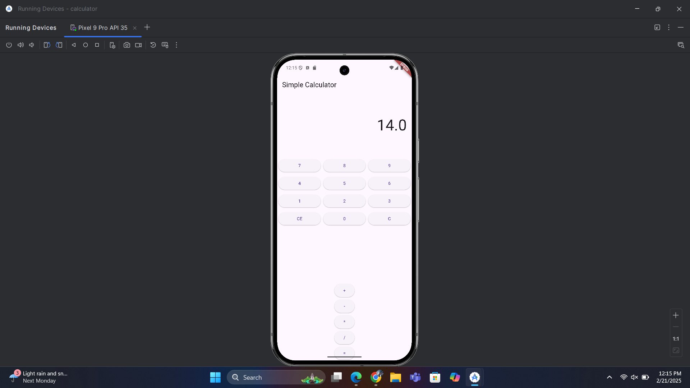

# calculator

Overview
This is a simple calculator application built using Flutter. The app allows users to perform basic
arithmetic operations such as addition, subtraction, multiplication, and division. 
The last calculated value is stored using SharedPreferences and displayed when the app is reopened.

Features
 1. We can do simple arithmetic operations: Addition (+), Subtraction (-), Multiplication (*),
and Division (/).
2. We can share a storage of the last calculated result using SharedPreferences
3. Here we have a user-friendly interface with digit buttons (0-9), operator buttons, and clear functions.
4. Limits display to 8 digits to prevent overflow

How It Works
Users input numbers using digit buttons and operators (+, -, *, /) store the first value and wait 
for the second input. Here how the button actually do;
The '=' button performs the calculation and displays the result.
The 'CE' button clears the current entry, while 'C' resets the entire calculation.
The last computed result is stored using SharedPreferences and displayed when the app is reopened.

Key Files & Modifications

 In  the main.dart file it contains the CalculatorApp class, which initializes SharedPreferences and
 retrieves the last saved value and the CalculatorScreen widget, which manages the user interface
 and calculator logic. Also, the state management functions like _onDigitPressed(),
 _onOperatorPressed(), _onEqualsPressed(), _onClearEntry(), and _onClear() to handle user interactions.

Modifications Made

Implemented SharedPreferences to store the last computed value.
Added validation to prevent overflow and handle division by zero.
Improved UI design with Material Design buttons and a structured layout.
Limited input to 8 digits to avoid excessively large numbers.

 - Here we have installled a dependendies and install a pub.get file on my folder

how this looks like?

